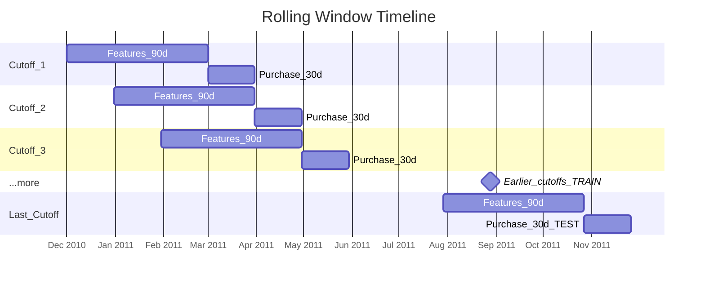

# Scaling Feature Engineering Pipelines with Feast and Ray

Link to article: *Coming Soon*

ML pipeline for predicting **30-day customer purchase propensity** using the
[UCI Online Retail dataset](https://archive.ics.uci.edu/dataset/352/online+retail),
with [Feast](https://feast.dev/) as the feature store and [Ray](https://www.ray.io/) for parallel feature engineering.

## Motivation

In a recent project building propensity models to predict customer purchases, I encountered feature engineering challenges that are common across many ML systems:

**1. Inadequate Feature Management**
- Feature definitions, lineage, and versions were not systematically tracked, limiting reusability and reproducibility of model runs
- Feature logic was manually maintained across separate training and inference scripts, risking inconsistent features between training and serving (training-serving skew)
- Features stored as flat files (CSV) lacked schema enforcement and support for scalable access

**2. High Feature Engineering Latency**
- Heavy workloads arise when computing window-based transformations over time-series data
- Sequential execution of rolling window computations (rather than parallel) significantly increases pipeline latency

These challenges can be addressed with a feature store (Feast) for centralized feature management and a distributed compute framework (Ray) for parallel execution.


## Project Overview

- **Problem**: Predict whether a customer will make at least one purchase in the next 30 days
- **Approach**: Rolling 90-day feature windows with 30-day purchase labels, generating
  multiple snapshots per customer across ~9 cutoff dates spaced 30 days apart
- **Features**: RFM + Behavioral signals, engineered in parallel via Ray, served via Feast offline store
- **Model**: XGBoost binary classifier
- **Feature Store**: Feast with PostgreSQL registry + Ray-backed offline store (2 feature views)
- **Train/test split**: Temporal: train on earlier cutoffs, test on the latest cutoff

## Why Feast and Ray

**[Feast](https://feast.dev/)**
- Feature store that keeps features organized and reusable.
- Features are computed once, stored as parquet, and retrieved via Python API with built-in point-in-time correctness (no data leakage).

**[Ray](https://www.ray.io/)**
- Distributed compute framework used in two ways in this project:
  1. **Feature engineering** (`pipeline.py`): each cutoff date runs as an independent `@ray.remote` task, so all cutoffs execute simultaneously instead of sequentially. Ray is used directly here, independent of Feast.
  2. **Feature retrieval** (`train.py` / `predict.py`): Feast's `RayOfflineStore` uses Ray under the hood to distribute parquet reads and point-in-time joins when `get_historical_features()` is called. Feast manages Ray internally here; no direct Ray calls in user code.
- Both uses are decoupled (separate processes, separate Ray sessions) and scale from laptop to cluster with no code changes.


## Project Structure

```
├── data/
│   └── input/
│       └── Online Retail.xlsx          # Raw UCI dataset
├── feature_store/
│   ├── feature_store.yaml              # Feast configuration
│   ├── definitions.py                  # Entity + FeatureView definitions
│   └── data/                           # Generated parquets (Feast data sources)
├── src/
│   ├── config.py                       # Centralized configuration
│   ├── pipeline.py                     # Top-level orchestrator (run via Makefile)
│   ├── data_prep/                      # Data preparation
│   │   ├── ingestion.py                # Raw data loading and cleaning
│   │   ├── cutoffs.py                  # Rolling cutoff date generation
│   │   └── labels.py                   # Purchase label computation
│   ├── feature_engineering/            # Feature engineering
│   │   ├── rfm_features.py             # RFM features (recency, frequency, monetary, tenure)
│   │   └── behavior_features.py        # Behavioral features (order value, basket size, etc.)
│   ├── train.py                        # Feast retrieval → temporal split → XGBoost training
│   └── predict.py                      # Batch prediction via Feast (latest cutoff)
├── models/                             # Saved model + predictions
├── docker-compose.yml                  # PostgreSQL for Feast registry
├── Makefile                            # Pipeline orchestration
└── requirements.txt
```

## Quick Start

### Prerequisites
- Python 3.10+
- Docker (running)

### 1. Get the Data
Download the [UCI Online Retail dataset](https://archive.ics.uci.edu/dataset/352/online+retail) and extract `Online Retail.xlsx` to:
```
data/input/Online Retail.xlsx
```

### 2. Install Dependencies
```bash
python -m venv venv
source venv/bin/activate  # On Windows: venv\Scripts\activate
pip install -r requirements.txt
```

### 3. Run the Pipeline
```bash
make all    # Runs: db → prep → apply → train
```

This will:
1. Start PostgreSQL (Feast registry) via Docker
2. Engineer features across rolling cutoffs using Ray
3. Register feature definitions in Feast
4. Train XGBoost model using features from Feast

### Individual Steps
```bash
make db         # Start PostgreSQL container
make prep       # Ray-based feature engineering → parquet files
make apply      # Register feature views in Feast registry
make train      # Retrieve features from Feast → train model
make predict    # Batch predictions on latest cutoff
make clean-db   # Stop PostgreSQL and remove data
```

## Rolling Window Design

Features are computed from a **90-day window** before each cutoff date,
and purchase labels use the **30-day window** after it. Cutoff dates are
spaced **30 days apart**, producing ~9 snapshots across the dataset.

```
For each cutoff C:
  Features: transactions in [C - 90d, C)
  Label:    purchased = 1 if at least one purchase in [C, C + 30d)
```



The same customer appears at multiple cutoffs with different feature values
and potentially different labels, yielding ~17,000 training rows (vs. ~3,700
with a single cutoff).

**Training vs. prediction**: The entity key is `(customer_id, event_timestamp)`.
During **training**, the entity DataFrame spans all cutoff dates. Feast's
point-in-time join pulls the correct 90-day feature snapshot for each.
During **prediction**, the entity DataFrame contains only the latest cutoff,
so Feast returns just that single snapshot per customer.

## Feature Views

**`customer_rfm_features`** - Classic customer-value signals (90-day window):
- `recency_days` - days since last purchase in the window
- `frequency` - number of distinct orders in the window
- `monetary` - total spend in the window
- `tenure_days` - days since first-ever purchase (all-time)

**`customer_behavior_features`** - Purchasing pattern signals (90-day window):
- `avg_order_value` - mean spend per order
- `avg_basket_size` - mean items per order
- `n_unique_products` - product diversity
- `return_rate` - share of cancelled orders
- `avg_days_between_purchases` - purchase cadence

## Feature Store Architecture

**Registry (PostgreSQL)**: Stores feature metadata (schemas, definitions, data sources). Uses PostgreSQL instead of local SQLite to simulate production-grade multi-user access.

**Offline Store (Ray)**: Feature data lives in parquet files. The `RayOfflineStore` distributes parquet reads and point-in-time joins across workers. When `get_historical_features()` is called, Feast performs temporal joins for each feature view, matching `(customer_id, event_timestamp)` to the correct feature snapshot. Ray parallelizes this work at scale.

**Production path**: Swap local PostgreSQL for Cloud SQL/RDS, point Ray at a remote cluster via `ray_address`, replace `FileSource` with `BigQuerySource`/`SnowflakeSource`, and run `feast apply` in CI/CD.

## Model Output

Models are saved in XGBoost's native JSON format (`models/xgb_purchase_model.json`) for human-readability, version safety, and security (avoiding pickle vulnerabilities).

## Pipeline Flow

```
Raw Data (Excel)
  ↓
Ray Parallel Feature Engineering (pipeline.py)
  → Computes features across rolling cutoffs → parquet files
  ↓
Feast Registry (feast apply)
  → Registers feature views in PostgreSQL
  ↓
Training (train.py)
  → Feast point-in-time join → temporal split → XGBoost → model.json
  ↓
Prediction (predict.py)
  → Feast retrieval (latest cutoff) → batch predictions → predictions.parquet
```
