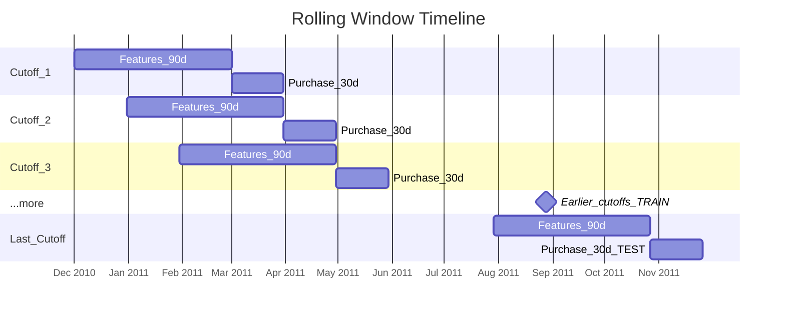
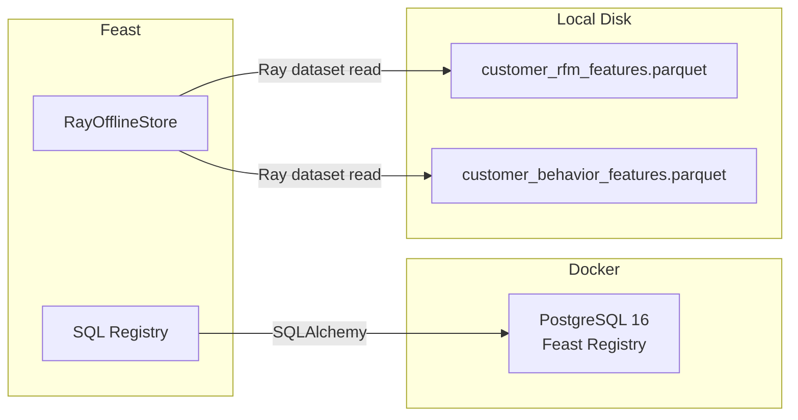

# Production Feature Engineering Pipelines with Feast and Ray

ML pipeline for predicting **30-day customer purchase propensity** using the
[UCI Online Retail dataset](https://archive.ics.uci.edu/dataset/352/online+retail),
with [Feast](https://feast.dev/) as the feature store and [Ray](https://www.ray.io/) for parallel feature engineering.

## Motivation and Context
In my recent work building a customer purchase propensity model for a major client, I came across 2 key structural challenges related to feature engineering while working within a constrained dev environment:
  1. Inadequate feature management
    - Feature lineage, data sources, dependencies, and versions were not clearly tracked systematically, making feature selection and auditing of ML runs difficult to manage.
      - Exacerbated by the heterogeneous data sources from which features are derived, and complex data transformation logic
    - Inconsistent entity definition (e.g., customer vs account vs portfolio) coupled with poor standardizations of event timestamps, snapshot dates, and aggregation windows
    - Features were saved in flat files, which is workable for initial POCs, but not stable or scalable for production use.
    - Lack of guardrails to prevent training-serving skew (i.e., ensure same features (and definitions) used for training and inference)

  2. Feature engineering pipeline latency
    - Due to the long historical coverage of the time series dataset, a large number of rolling windows had to be computed. These were executed sequentially, and the many features derived from each window compounded processing time, leading to high end-to-end pipeline latency.

The above challenges can be mitigated by implementing a feature store like Feast and a distributed compute framework like Ray.


## Project Overview

- **Problem**: Predict whether a customer will make at least one purchase in the next 30 days
- **Approach**: Rolling 90-day feature windows with 30-day purchase labels, generating
  multiple snapshots per customer across ~9 cutoff dates spaced 30 days apart
- **Features**: RFM + Behavioral signals, engineered in parallel via Ray, served via Feast offline store
- **Model**: XGBoost binary classifier
- **Feature Store**: Feast with PostgreSQL registry + Ray-backed offline store (2 feature views)
- **Train/test split**: Temporal: train on earlier cutoffs, test on the latest cutoff

## Why Feast and Ray

**[Feast](https://feast.dev/)**
- Feature store that keeps features organized and reusable.
- Features are computed once, stored as parquet, and retrieved via Python API with built-in point-in-time correctness (no data leakage).

**[Ray](https://www.ray.io/)**
- Distributed compute framework used in two ways in this project:
  1. **Feature engineering** (`pipeline.py`): each cutoff date runs as an independent `@ray.remote` task, so all cutoffs execute simultaneously instead of sequentially. Ray is used directly here, independent of Feast.
  2. **Feature retrieval** (`train.py` / `predict.py`): Feast's `RayOfflineStore` uses Ray under the hood to distribute parquet reads and point-in-time joins when `get_historical_features()` is called. Feast manages Ray internally here; no direct Ray calls in user code.
- Both uses are decoupled (separate processes, separate Ray sessions) and scale from laptop to cluster with no code changes.

## Data

The UCI Online Retail dataset is available [here](https://archive.ics.uci.edu/dataset/352/online+retail).

## Project Structure

```
├── data/
│   └── input/
│       └── Online Retail.xlsx          # Raw UCI dataset
├── feature_store/
│   ├── feature_store.yaml              # Feast configuration
│   ├── definitions.py                  # Entity + FeatureView definitions
│   └── data/                           # Generated parquets (Feast data sources)
├── src/
│   ├── config.py                       # Centralized configuration
│   ├── pipeline.py                     # Top-level orchestrator (run via Makefile)
│   ├── data_prep/                      # Data preparation
│   │   ├── ingestion.py                # Raw data loading and cleaning
│   │   ├── cutoffs.py                  # Rolling cutoff date generation
│   │   └── labels.py                   # Purchase label computation
│   ├── feature_engineering/            # Feature engineering
│   │   ├── rfm_features.py             # RFM features (recency, frequency, monetary, tenure)
│   │   └── behavior_features.py        # Behavioral features (order value, basket size, etc.)
│   ├── train.py                        # Feast retrieval → temporal split → XGBoost training
│   └── predict.py                      # Batch prediction via Feast (latest cutoff)
├── models/                             # Saved model + predictions
├── docker-compose.yml                  # PostgreSQL for Feast registry
├── Makefile                            # Pipeline orchestration
└── requirements.txt
```

## Prerequisites

- Python 3.10+
- Docker (for the PostgreSQL registry)

## Setup

```bash
python -m venv venv
source venv/bin/activate
pip install -r requirements.txt
```

Place `Online Retail.xlsx` in the `data/input/` directory.

## Usage

Run the full pipeline:

```bash
make all        # db → prep → apply → train
```

Or run steps individually:

```bash
make db         # Start PostgreSQL via Docker (Feast registry backend)
make prep       # Ingest Excel, engineer rolling features, save parquets
make apply      # Register Feast feature definitions in PostgreSQL
make train      # Train XGBoost using Feast offline store (temporal split)
make predict    # Batch-score customers at the latest cutoff
```

To tear down the database:

```bash
make clean-db   # Stop PostgreSQL container and remove volume
```

## Rolling Window Design

Features are computed from a **90-day window** before each cutoff date,
and purchase labels use the **30-day window** after it. Cutoff dates are
spaced **30 days apart**, producing ~9 snapshots across the dataset.

```
For each cutoff C:
  Features: transactions in [C - 90d, C)
  Label:    purchased = 1 if at least one purchase in [C, C + 30d)
```



The same customer appears at multiple cutoffs with different feature values
and potentially different labels, yielding ~17,000 training rows (vs. ~3,700
with a single cutoff).

**Training vs. prediction**: The entity key is `(customer_id, event_timestamp)`.
During **training**, the entity DataFrame spans all cutoff dates. Feast's
point-in-time join pulls the correct 90-day feature snapshot for each.
During **prediction**, the entity DataFrame contains only the latest cutoff,
so Feast returns just that single snapshot per customer.

## Feature Views

**`customer_rfm_features`** - Classic customer-value signals (90-day window):
- `recency_days` - days since last purchase in the window
- `frequency` - number of distinct orders in the window
- `monetary` - total spend in the window
- `tenure_days` - days since first-ever purchase (all-time)

**`customer_behavior_features`** - Purchasing pattern signals (90-day window):
- `avg_order_value` - mean spend per order
- `avg_basket_size` - mean items per order
- `n_unique_products` - product diversity
- `return_rate` - share of cancelled orders
- `avg_days_between_purchases` - purchase cadence

## Feature Store Infrastructure

A Feast feature store has two core components: a **registry** (metadata
catalog of what features exist) and **data sources** (the actual feature
values). This project moves beyond a purely local setup to simulate
production-grade infrastructure using Docker.



**Registry (metadata)**: Stored in PostgreSQL via Docker, replacing the
default local SQLite file. The registry holds feature view definitions,
entity schemas, and data source locations. Using PostgreSQL means multiple
data scientists and services can read from and write to the same registry
concurrently, which is essential for team collaboration in production.

**Offline store (feature values)**: Feature data lives in parquet files
on local disk (simulating cloud object storage like S3/GCS). The offline
store **engine** controls how Feast reads these files and performs joins.

By default, Feast uses the `FileOfflineStore`, which reads parquets into
pandas and joins in a single process. This project upgrades to the
`RayOfflineStore` (`type: ray`), which uses Ray to distribute reads and
joins across multiple workers. The underlying parquet files are unchanged;
only the compute engine is different.

**Why this matters**: when `get_historical_features()` is called, Feast
performs a point-in-time join (i.e., data from specific timepoint) for each feature view, matching every
`(customer_id, event_timestamp)` row in the entity DataFrame to the
correct feature snapshot where the feature timestamp is <= the entity
timestamp. With 2 feature views, that's 2 temporal joins. As entity
DataFrames grow to millions of rows and more feature views are added,
these joins become the bottleneck. The Ray offline store parallelizes
this work, keeping retrieval times manageable at scale.

The registry is a lightweight metadata catalog (small, write-heavy during
development), while the offline store holds large volumes of feature data
(read-heavy during training). Separating them allows each to scale
independently.

### Production next steps
- **Registry**: Replace the local PostgreSQL connection string with a
  managed database (e.g., Cloud SQL, Amazon RDS) or use an S3/GCS path
  for a file-based registry in the cloud
- **Offline store**: Point the Ray offline store at a remote Ray cluster
  (`ray_address` config) or deploy via KubeRay for elastic scaling.
  Swap `FileSource` for `BigQuerySource` / `SnowflakeSource` depending
  on your data warehouse
- **CI/CD**: Run `feast apply` in a CI pipeline so that feature definitions
  are version-controlled and reviewed before being registered

## Model Serialization

- The trained XGBoost model is saved as `models/xgb_purchase_model.json` using XGBoost's native JSON format.
- JSON is preferred over pickle because it is:
  - **human-readable** (you can inspect the tree structure directly)
  - **version-safe** (no Python-version or XGBoost-version deserialization issues)
  - **secure** (pickle can execute arbitrary code on load)

## Pipeline Flow

```
Online Retail.xlsx
  → data_prep/      → rolling cutoffs → 2 multi-snapshot parquets
  → feast apply     → registers feature views + entity schemas in Feast registry
  → train.py        → Feast point-in-time join → temporal split → XGBoost → model (.json)
  → predict.py      → Feast retrieval (latest cutoff) → batch predictions
```
